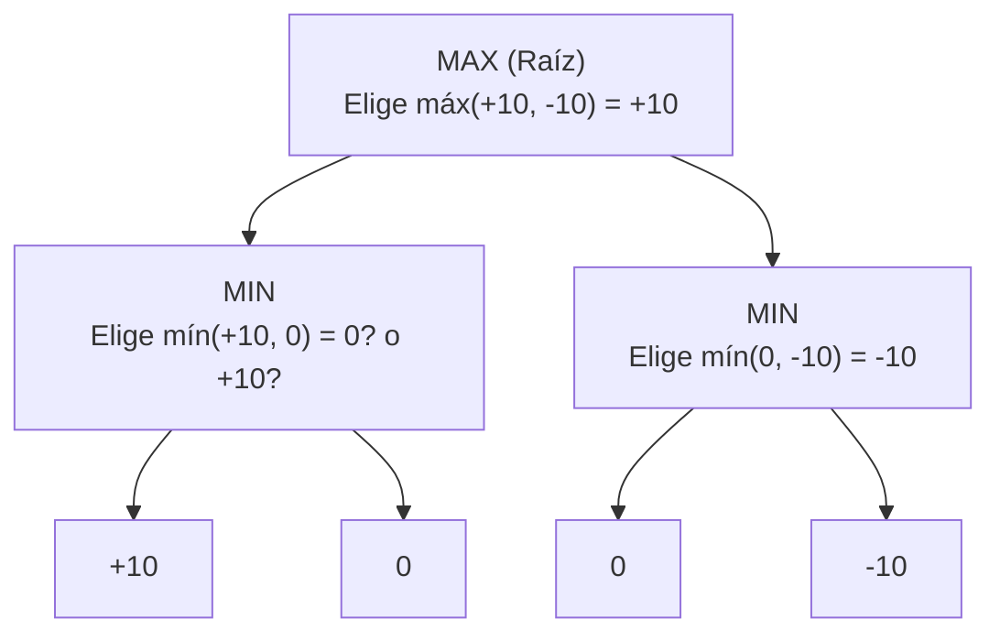

# Unidad 13: Algoritmo Minimax y Poda Alfa-Beta en C++

En la teoría de juegos y estructuras de datos para inteligencia artificial, los árboles de juego modelan decisiones en juegos de dos jugadores por turnos de suma cero e información perfecta (como Tres en Línea, Ajedrez, Damas o Conecta 4).

---

## Índice
1. [El Árbol de Juego: MAX vs MIN](#1-el-árbol-de-juego-max-vs-min)
2. [Algoritmo Minimax Puro](#2-algoritmo-minimax-puro)
3. [La Poda Alfa-Beta ($\alpha$-$\beta$ Pruning)](#3-la-poda-alfa-beta-alpha-beta-pruning)
   - [Significado de los Parámetros $\alpha$ y $\beta$](#significado-de-los-parámetros-alpha-y-beta)
   - [Condición de Poda](#condición-de-poda)
4. [Implementación en C++](#4-implementación-en-c)
5. [Función de Evaluación Heurística](#5-función-de-evaluación-heurística)
6. [Análisis de Complejidad](#6-análisis-de-complejidad)

---

## 1. El Árbol de Juego: MAX vs MIN

* **Nodo MAX (Tu turno):** Busca la jugada que **maximice** la puntuación.
* **Nodo MIN (Turno del rival):** Se asume que juega de manera óptima y elegirá la jugada que **minimice** tu puntuación.
* **Hojas:** Estados terminales donde el juego termina o se alcanza la profundidad límite; se les asigna una puntuación estática mediante una **función de evaluación**.



---

## 2. Algoritmo Minimax Puro

Propaga los valores desde las hojas hacia la raíz mediante llamadas recursivas alternadas:

```cpp
#include <algorithm>
#include <climits>
using namespace std;

// Versión simplificada sobre arreglo de hojas
int minimax(int profundidad, int indiceNodo, bool esTurnoMax, int puntajes[], int h) {
    // Si llegamos a la profundidad límite (hojas)
    if (profundidad == h) {
        return puntajes[indiceNodo];
    }

    if (esTurnoMax) {
        return max(
            minimax(profundidad + 1, indiceNodo * 2, false, puntajes, h),
            minimax(profundidad + 1, indiceNodo * 2 + 1, false, puntajes, h)
        );
    } else {
        return min(
            minimax(profundidad + 1, indiceNodo * 2, true, puntajes, h),
            minimax(profundidad + 1, indiceNodo * 2 + 1, true, puntajes, h)
        );
    }
}
```

---

## 3. La Poda Alfa-Beta ($\alpha$-$\beta$ Pruning)

El algoritmo Minimax estándar evalúa ramas innecesarias. La **Poda Alfa-Beta** descarta subárboles completos cuando ya se sabe que el rival o nosotros tenemos una opción mejor confirmada en otra parte.

### Significado de los Parámetros $\alpha$ y $\beta$
* **$\alpha$:** El mejor valor que el jugador **MAX** tiene garantizado hasta el momento (inicialmente $-\infty$).
* **$\beta$:** El mejor valor que el jugador **MIN** tiene garantizado hasta el momento (inicialmente $+\infty$).

### Condición de Poda
Si en cualquier punto de la exploración ocurre:
$$\beta \le \alpha$$
**Se produce una poda**: se detiene inmediatamente la evaluación de los hermanos restantes de ese nodo, porque el jugador adversario nunca permitirá que el juego llegue a ese estado.

---

## 4. Implementación en C++

```cpp
#include <iostream>
#include <algorithm>
#include <climits>
using namespace std;

int minimaxAlfaBeta(int profundidad, int indiceNodo, bool esMax,
                     int valores[], int alfa, int beta, int h) {
    if (profundidad == h) {
        return valores[indiceNodo];
    }

    if (esMax) {
        int mejor = INT_MIN;
        for (int i = 0; i < 2; i++) {
            int valor = minimaxAlfaBeta(profundidad + 1, indiceNodo * 2 + i,
                                        false, valores, alfa, beta, h);
            mejor = max(mejor, valor);
            alfa = max(alfa, mejor);

            // Condición de Poda Alfa
            if (beta <= alfa) {
                break; // Ramas restantes descartadas
            }
        }
        return mejor;
    } else {
        int mejor = INT_MAX;
        for (int i = 0; i < 2; i++) {
            int valor = minimaxAlfaBeta(profundidad + 1, indiceNodo * 2 + i,
                                        true, valores, alfa, beta, h);
            mejor = min(mejor, valor);
            beta = min(beta, mejor);

            // Condición de Poda Beta
            if (beta <= alfa) {
                break; // Ramas restantes descartadas
            }
        }
        return mejor;
    }
}
```

---

## 5. Función de Evaluación Heurística

En juegos con árboles gigantes (como el ajedrez con factor de ramificación $\approx 35$), es imposible llegar a las hojas terminales. Se define una cota máxima de profundidad y en el nivel límite se aplica una función heurística:

$$\text{Evaluación}(Tablero) = \text{VentajaMaterial}(MAX) - \text{VentajaMaterial}(MIN) + \text{ControlCentro} + \dots$$

---

## 6. Análisis de Complejidad

| Algoritmo | Peor Caso (Tiempo) | Mejor Caso con Poda Óptima | Espacio en Memoria |
| :--- | :---: | :---: | :---: |
| **Minimax Estándar** | $O(b^d)$ | $O(b^d)$ | $O(b \cdot d)$ |
| **Minimax con Poda Alfa-Beta** | $O(b^d)$ | $\mathbf{O(b^{d/2})}$ | $O(b \cdot d)$ |

> En el mejor orden de visitas, la poda permite duplicar la profundidad del análisis ($2d$) en el mismo tiempo computacional.
