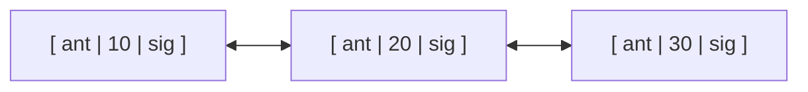
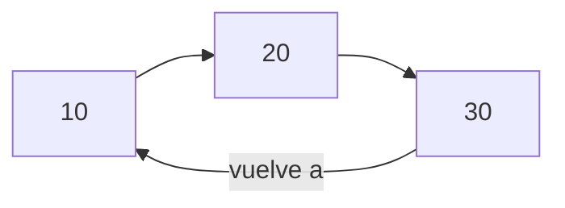

# Unidad 05: Nodos y Listas Enlazadas en C++

Las listas enlazadas son la primera estructura de datos dinámica no contigua. A diferencia de los arreglos estáticos o dinámicos (`std::vector`), los elementos de una lista enlazada están dispersos en el Heap y unidos exclusivamente a través de punteros.

---

## Índice
1. [El Concepto de Nodo](#1-el-concepto-de-nodo)
2. [Lista Simplemente Enlazada](#2-lista-simplemente-enlazada)
   - [Estructura del Nodo y de la Clase](#estructura-del-nodo-y-de-la-clase)
   - [Inserción al Inicio ($O(1)$)](#inserción-al-inicio-o1)
   - [Inserción al Final ($O(n)$ o $O(1)$ con `tail`)](#inserción-al-final-on-o-o1-con-tail)
   - [Inserción Ordenada](#inserción-ordenada)
   - [Búsqueda y Recorrido](#búsqueda-y-recorrido)
   - [Eliminación de un Nodo](#eliminación-de-un-nodo)
   - [Destructor y Liberación de Memoria](#destructor-y-liberación-de-memoria)
3. [Lista Doblemente Enlazada](#3-lista-doblemente-enlazada)
4. [Lista Circular](#4-lista-circular)
5. [Casos Bordes y Errores Habituales](#5-casos-bordes-y-errores-habituales)
6. [Implementación Completa en C++](#6-implementación-completa-en-c)

---

## 1. El Concepto de Nodo

Un **Nodo** es la unidad atómica de almacenamiento en estructuras enlazadas. Contiene al menos:
* **Dato o Carga Útil:** La información que guardamos (un entero, un objeto `Estudiante`, etc.).
* **Puntero de Enlace:** La dirección del siguiente nodo en memoria.

```cpp
struct Nodo {
    int dato;
    Nodo* siguiente;

    // Constructor para inicializar limpiamente
    Nodo(int valor) : dato(valor), siguiente(nullptr) {}
};
```

---

## 2. Lista Simplemente Enlazada

Cada nodo apunta únicamente al siguiente nodo. El puntero del último nodo apunta siempre a `nullptr`.


### Operaciones Fundamentales

#### Inserción al Inicio ($O(1)$)
```cpp
void insertarInicio(Nodo*& cabeza, int valor) {
    Nodo* nuevo = new Nodo(valor);
    nuevo->siguiente = cabeza;
    cabeza = nuevo;
}
```

#### Inserción al Final ($O(n)$)
```cpp
void insertarFinal(Nodo*& cabeza, int valor) {
    Nodo* nuevo = new Nodo(valor);
    if (cabeza == nullptr) {
        cabeza = nuevo;
        return;
    }
    Nodo* actual = cabeza;
    while (actual->siguiente != nullptr) {
        actual = actual->siguiente;
    }
    actual->siguiente = nuevo;
}
```

#### Búsqueda ($O(n)$)
```cpp
bool buscar(Nodo* cabeza, int valorBuscado) {
    Nodo* actual = cabeza;
    while (actual != nullptr) {
        if (actual->dato == valorBuscado) return true;
        actual = actual->siguiente;
    }
    return false;
}
```

#### Eliminación ($O(n)$)
```cpp
void eliminar(Nodo*& cabeza, int valorAEliminar) {
    if (cabeza == nullptr) return;

    // Caso 1: El elemento a eliminar es la cabeza
    if (cabeza->dato == valorAEliminar) {
        Nodo* aBorrar = cabeza;
        cabeza = cabeza->siguiente;
        delete aBorrar;
        return;
    }

    // Caso 2: El elemento está en el cuerpo o final
    Nodo* actual = cabeza;
    while (actual->siguiente != nullptr && actual->siguiente->dato != valorAEliminar) {
        actual = actual->siguiente;
    }

    if (actual->siguiente != nullptr) {
        Nodo* aBorrar = actual->siguiente;
        actual->siguiente = actual->siguiente->siguiente;
        delete aBorrar;
    }
}
```

#### Liberación de Toda la Lista (Destructor)
```cpp
void liberarLista(Nodo*& cabeza) {
    Nodo* actual = cabeza;
    while (actual != nullptr) {
        Nodo* aBorrar = actual;
        actual = actual->siguiente;
        delete aBorrar;
    }
    cabeza = nullptr;
}
```

---

## 3. Lista Doblemente Enlazada

Cada nodo almacena **dos punteros**: uno hacia el nodo siguiente (`sig`) y otro hacia el anterior (`ant`).



```cpp
struct NodoDoble {
    int dato;
    NodoDoble* siguiente;
    NodoDoble* anterior;

    NodoDoble(int val) : dato(val), siguiente(nullptr), anterior(nullptr) {}
};
```
* **Ventaja:** Permite navegar hacia adelante y hacia atrás en $O(1)$, y eliminar un nodo dado directamente en $O(1)$ sin buscar al predecesor.
* **Desventaja:** Consume más memoria (un puntero extra por cada elemento).

---

## 4. Lista Circular

En una lista circular, el último nodo no apunta a `nullptr`, sino que apunta nuevamente al primer nodo (`cabeza`).



> [!CAUTION]
> En listas circulares, una condición `while (actual != nullptr)` causará un **bucle infinito**. La condición de parada correcta es `while (actual->siguiente != cabeza)`.

---

## 5. Casos Bordes y Errores Habituales

1. **Lista vacía (`cabeza == nullptr`):** Siempre verifica si la lista está vacía antes de consultar `cabeza->dato` o `cabeza->siguiente`.
2. **Lista de un solo nodo:** Al eliminar el único nodo, la cabeza debe quedar en `nullptr`.
3. **Pérdida de la cadena:** Si haces `cabeza = cabeza->siguiente` sin guardar `cabeza` previamente en una variable temporal `aBorrar`, provocas un *memory leak*.
4. **Acceso después de liberar (*use-after-free*):**
   ```cpp
   // ❌ ERROR GRAVE:
   delete actual;
   actual = actual->siguiente; // Crash: actual ya no existe
   
   // ✅ FORMA CORRECTA:
   Nodo* temp = actual;
   actual = actual->siguiente;
   delete temp;
   ```

---

## 6. Implementación Completa en C++

```cpp
#include <iostream>
using namespace std;

class ListaSimple {
private:
    struct Nodo {
        int dato;
        Nodo* sig;
        Nodo(int v) : dato(v), sig(nullptr) {}
    };
    Nodo* head;

public:
    ListaSimple() : head(nullptr) {}

    ~ListaSimple() {
        Nodo* curr = head;
        while (curr != nullptr) {
            Nodo* temp = curr;
            curr = curr->sig;
            delete temp;
        }
    }

    void push_front(int val) {
        Nodo* nuevo = new Nodo(val);
        nuevo->sig = head;
        head = nuevo;
    }

    void imprimir() const {
        Nodo* curr = head;
        cout << "[ ";
        while (curr != nullptr) {
            cout << curr->dato << " -> ";
            curr = curr->sig;
        }
        cout << "nullptr ]" << endl;
    }
};

int main() {
    ListaSimple lista;
    lista.push_front(30);
    lista.push_front(20);
    lista.push_front(10);
    lista.imprimir(); // Imprime: [ 10 -> 20 -> 30 -> nullptr ]
    return 0;
}
```
