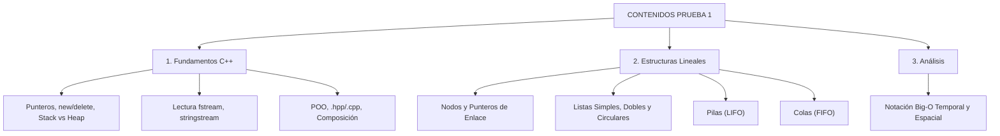

# Guía de Preparación: Contenidos para la Prueba 1

Este documento clasifica, sintetiza y organiza todos los contenidos teóricos y prácticos que se evalúan en la **Prueba 1 (Certamen 1)** de la asignatura de **Estructura de Datos en C++**.

---

## Índice General
1. [Mapa Temático de la Prueba 1](#1-mapa-temático-de-la-prueba-1)
2. [Unidad 00: Debugging y Compilación](#unidad-00-debugging-y-compilación)
3. [Unidad 01: Punteros, Referencias y Memoria Dinámica](#unidad-01-punteros-referencias-y-memoria-dinámica)
4. [Unidad 02: Lectura y Escritura de Archivos](#unidad-02-lectura-y-escritura-de-archivos)
5. [Unidad 03: POO y Modularización](#unidad-03-poo-y-modularización)
6. [Unidad 04: Complejidad Algorítmica (Big-O)](#unidad-04-complejidad-algorítmica-big-o)
7. [Unidad 05: Nodos y Listas Enlazadas](#unidad-05-nodos-y-listas-enlazadas)
8. [Unidad 06: Pilas (Stacks) y Colas (Queues)](#unidad-06-pilas-stacks-y-colas-queues)
9. [Checklist de Estudio para la Prueba 1](#9-checklist-de-estudio-para-la-prueba-1)
10. [Errores Típicos que Cuestan Puntos](#10-errores-típicos-que-cuestan-puntos)

---

## 1. Mapa Temático de la Prueba 1

La Prueba 1 se enfoca en el dominio del lenguaje C++, la gestión manual y segura de la memoria RAM y las estructuras de datos lineales enlazadas.

---

## Unidad 00: Debugging y Compilación
* **Conceptos clave:** Banderas de compilación (`-Wall -Wextra -g`), detección de `Segmentation Fault`, uso de `nullptr`.
* **Herramientas:** AddressSanitizer (`-fsanitize=address`) y GDB.
* **Guía detallada:** [Ver Unidad 00: Debugging](../Debugging/README.md).

---

## Unidad 01: Punteros, Referencias y Memoria Dinámica
* **Conceptos clave:**
  - Diferencia entre Stack (memoria automática) y Heap (memoria dinámica manual).
  - Operador de dirección `&` y operador de desreferenciación `*`.
  - Diferencia entre puntero (`T*`) y referencia (`T&`).
  - Asignación dinámica: `new` vs `delete`, `new[]` vs `delete[]`.
  - Punteros dobles (`T**`) para matrices dinámicas y modificación de cabezas por referencia.
  - Fugas de memoria (*Memory Leaks*) y punteros colgantes (*Dangling Pointers*).
* **Guía detallada:** [Ver Unidad 01: Punteros](../Punteros/readme.md).

---

## Unidad 02: Lectura y Escritura de Archivos
* **Conceptos clave:**
  - Flujos `<fstream>`: `ifstream` (lectura) y `ofstream` (escritura).
  - Verificación obligatoria: `if (!archivo.is_open()) return;`.
  - Lectura línea por línea con `getline(archivo, linea)`.
  - Parseo con `<sstream>` y delimitadores: `getline(ss, campo, ',')`.
  - Conversión de tipos con `stoi()`, `stod()`, `stof()`.
* **Guía detallada:** [Ver Unidad 02: Lectura de Archivos](../LecturaArchivos/readme.md).

---

## Unidad 03: POO y Modularización
* **Conceptos clave:**
  - Separación obligatoria de cabecera (`.hpp`) e implementación (`.cpp`).
  - Directiva `#pragma once`.
  - Constructores (inicializar punteros a `nullptr`) y Destructores (liberación recursiva o secuencial de nodos).
  - Modificadores de acceso: `public`, `private`, `protected`.
  - Relaciones entre clases: Asociación, Agregación y Composición fuerte.
* **Guía detallada:** [Ver Unidad 03: Conexiones y Clases](../ConexionesClases/readme.md).

---

## Unidad 04: Complejidad Algorítmica (Big-O)
* **Conceptos clave:**
  - Notación Big-O: Cota superior en el peor caso.
  - Jerarquía: $O(1) < O(\log n) < O(n) < O(n \log n) < O(n^2) < O(2^n)$.
  - Cálculo de costo en bucles simples, anidados y multiplicativos.
  - Complejidad espacial auxiliar.
* **Guía detallada:** [Ver Unidad 04: Complejidad Algorítmica](../ComplejidadAlgoritmica/README.md).

---

## Unidad 05: Nodos y Listas Enlazadas
* **Conceptos clave:**
  - Estructura atómica del `Nodo` (`dato` y `puntero siguiente`).
  - Lista Simple: inserción al inicio ($O(1)$), al final ($O(n)$ o $O(1)$ con `cola`), búsqueda ($O(n)$), eliminación ($O(n)$).
  - Lista Doble: punteros `anterior` y `siguiente`, eliminación en $O(1)$ con puntero directo.
  - Lista Circular: el último nodo apunta a la cabeza (cuidado con bucles infinitos).
  - Destructor de la lista para no dejar ningún nodo huérfano en el Heap.
* **Guía detallada:** [Ver Unidad 05: Nodos y Listas Enlazadas](../NodosYListasEnlazadas/README.md).

---

## Unidad 06: Pilas (Stacks) y Colas (Queues)
* **Conceptos clave:**
  - Pila: Principio LIFO (*Last In, First Out*). Operaciones `push`, `pop`, `top`, `empty` en $O(1)$.
  - Cola: Principio FIFO (*First In, First Out*). Operaciones `enqueue`, `dequeue`, `front`, `empty` en $O(1)$.
  - Implementación manual mediante nodos enlazados (requisito típico sin STL).
  - Problemas clásicos: Balanceo de paréntesis, inversión de cadenas, simulación de turnos.
* **Guía detallada:** [Ver Unidad 06: Pilas y Colas](../PilasYColas/README.md).

---

## 9. Checklist de Estudio para la Prueba 1

- [ ] ¿Sé declarar e inicializar punteros y sé cuándo usar `*` y `&`?
- [ ] ¿Entiendo la diferencia entre `int* p = new int[5]` y `delete[] p`?
- [ ] ¿Puedo escribir una función que lea un archivo CSV y cree una lista enlazada con los datos?
- [ ] ¿Sé crear una clase con archivo `.hpp` y `.cpp` que tenga su destructor que libere todos los nodos?
- [ ] ¿Sé insertar y eliminar un nodo en una lista simple cubriendo el caso de lista vacía, cabeza y final?
- [ ] ¿Sé identificar si un fragmento de código es $O(n)$, $O(n^2)$ o $O(\log n)$?
- [ ] ¿Sé implementar una Pila y una Cola desde cero con nodos y punteros?

---

## 10. Errores Típicos que Cuestan Puntos

1. **Memory Leaks:** Olvidar hacer `delete` de los nodos eliminados o no implementar el destructor en la clase Lista.
2. **Segmentation Fault por desreferenciación nula:** Intentar hacer `actual->siguiente` cuando `actual` es `nullptr`.
3. **Pérdida del puntero de la cabeza:** Sobreescribir `cabeza = nuevo` antes de enlazar `nuevo->siguiente = cabeza`.
4. **Olvidar `[]` en arreglos:** Escribir `delete arreglo;` en vez de `delete[] arreglo;`.
5. **Condición de fin en listas circulares:** Escribir `while (actual != nullptr)` en lugar de `while (actual->siguiente != cabeza)`.
