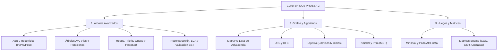

# Guía de Preparación: Contenidos para la Prueba 2

Este documento clasifica, sintetiza y organiza todos los contenidos avanzados evaluados en la **Prueba 2 (Certamen 2)** de la asignatura de **Estructura de Datos en C++**.

---

## Índice General
1. [Mapa Temático de la Prueba 2](#1-mapa-temático-de-la-prueba-2)
2. [Unidad 07: Árboles Binarios y ABB](#unidad-07-árboles-binarios-y-abb)
3. [Unidad 08: Árboles AVL y Rotaciones](#unidad-08-árboles-avl-y-rotaciones)
4. [Unidad 09: Heaps, Colas de Prioridad y HeapSort](#unidad-09-heaps-colas-de-prioridad-y-heapsort)
5. [Unidad 10: Algoritmos Avanzados en Árboles](#unidad-10-algoritmos-avanzados-en-árboles)
6. [Unidad 11: Fundamentos y Representación de Grafos](#unidad-11-fundamentos-y-representación-de-grafos)
7. [Unidad 12: Algoritmos en Grafos (DFS, BFS, Dijkstra, MST)](#unidad-12-algoritmos-en-grafos-dfs-bfs-dijkstra-mst)
8. [Unidad 13: Minimax y Poda Alfa-Beta](#unidad-13-minimax-y-poda-alfa-beta)
9. [Unidad 14: Matrices Poco Pobladas (Sparse Matrices)](#unidad-14-matrices-poco-pobladas-sparse-matrices)
10. [Checklist de Estudio para la Prueba 2](#10-checklist-de-estudio-para-la-prueba-2)
11. [Ejercicios Clásicos de Examen](#11-ejercicios-clásicos-de-examen)

---

## 1. Mapa Temático de la Prueba 2

La Prueba 2 abarca estructuras jerárquicas no lineales, optimización algorítmica y teoría de grafos:

---

## Unidad 07: Árboles Binarios y ABB
* **Conceptos clave:**
  - Propiedad fundamental del ABB: $\text{izq} < \text{nodo} < \text{der}$.
  - Recorridos: Inorden (ordena ascendentemente), Preorden (copia), Postorden (libera memoria).
  - Eliminación de nodos: Casos 0, 1 y 2 hijos (reemplazo por sucesor inorden).
* **Guía detallada:** [Ver Unidad 07: Árboles Binarios](../ArbolesBinarios/README.md).

---

## Unidad 08: Árboles AVL y Rotaciones
* **Conceptos clave:**
  - Factor de Balance: $\text{FB} = \text{altura}(\text{izq}) - \text{altura}(\text{der}) \in \{-1, 0, 1\}$.
  - 4 Rotaciones:
    * **LL (Simple Derecha):** Desbalance izquierdo con inserción a la izquierda.
    * **RR (Simple Izquierda):** Desbalance derecho con inserción a la derecha.
    * **LR (Doble Izq-Der):** Rotación simple izquierda en hijo, luego derecha en raíz.
    * **RL (Doble Der-Izq):** Rotación simple derecha en hijo, luego izquierda en raíz.
  - Garantía estricta de complejidad: $O(\log n)$ para búsqueda, inserción y borrado.
* **Guía detallada:** [Ver Unidad 08: Árboles AVL](../ArbolesAVL/README.md).

---

## Unidad 09: Heaps, Colas de Prioridad y HeapSort
* **Conceptos clave:**
  - Mapeo en arreglo: padre $\lfloor(i-1)/2\rfloor$, hijos $2i+1$ y $2i+2$.
  - Max-Heap (raíz es el máximo) y Min-Heap (raíz es el mínimo).
  - Operaciones: `heapify` ($O(\log n)$), `buildHeap` ($O(n)$).
  - Algoritmo HeapSort: Ordenamiento in-place en tiempo $O(n \log n)$ y espacio $O(1)$.
  - Uso de `std::priority_queue` en C++.
* **Guía detallada:** [Ver Unidad 09: Heaps y HeapSort](../HeapsYHeapSort/README.md).

---

## Unidad 10: Algoritmos Avanzados en Árboles
* **Conceptos clave:**
  - Recorrido por niveles (BFS en árboles usando `std::queue`).
  - Reconstrucción única de árboles con Inorden + Preorden o Inorden + Postorden.
  - Validación de BST comprobando rangos válidos $(min, max)$ en $O(n)$.
  - Ancestro Común más Cercano (LCA) en BST ($O(h)$) y en Árbol General ($O(n)$).
* **Guía detallada:** [Ver Unidad 10: Algoritmos en Árboles](../AlgoritmosArboles/README.md).

---

## Unidad 11: Fundamentos y Representación de Grafos
* **Conceptos clave:**
  - Definición formal: $G = (V, E)$, dígrafos, grafos ponderados, ciclos.
  - Matriz de Adyacencia: $O(V^2)$ en memoria, ideal para grafos densos.
  - Lista de Adyacencia: $O(V + E)$ en memoria, estándar para grafos dispersos.
* **Guía detallada:** [Ver Unidad 11: Fundamentos de Grafos](../Grafos/readme.md).

---

## Unidad 12: Algoritmos en Grafos (DFS, BFS, Dijkstra, MST)
* **Conceptos clave:**
  - **DFS:** Profundidad con recursión/pila, componentes conexas, detección de ciclos ($O(V + E)$).
  - **BFS:** Anchura con cola, camino más corto en grafos sin ponderar ($O(V + E)$).
  - **Dijkstra:** Camino más corto con pesos no negativos usando Min-Heap ($O((V+E)\log V)$).
  - **Kruskal:** Árbol de Expansión Mínima ordenando aristas con DSU ($O(E \log E)$).
  - **Prim:** Árbol de Expansión Mínima haciendo crecer un árbol por arista más barata ($O((V+E)\log V)$).
* **Guía detallada:** [Ver Unidad 12: Algoritmos en Grafos](../AlgoritmosGrafos/README.md).

---

## Unidad 13: Minimax y Poda Alfa-Beta
* **Conceptos clave:**
  - Árbol de juego para decisiones entre jugadores MAX y MIN.
  - Función de evaluación y propagación recursiva de puntajes.
  - Poda Alfa-Beta: Descarte de ramas cuando $\beta \le \alpha$. Reduce complejidad a $O(b^{d/2})$.
* **Guía detallada:** [Ver Unidad 13: Minimax y Poda Alfa-Beta](../MinimaxYAlfaBeta/README.md).

---

## Unidad 14: Matrices Poco Pobladas (Sparse Matrices)
* **Conceptos clave:**
  - Justificación de ahorro de memoria cuando $> 70\%$ de celdas son nulas.
  - Formato COO (Coordinate Format: filas, columnas, valores).
  - Formato CSR (Compressed Sparse Row: valores, columnas, fila_ptr).
  - Listas Cruzadas Ortogonales con punteros derecha y abajo.
* **Guía detallada:** [Ver Unidad 14: Matrices Poco Pobladas](../MatricesDispersas/README.md).

---

## 10. Checklist de Estudio para la Prueba 2

- [ ] ¿Sé ejecutar a mano una inserción en un árbol AVL y dibujar la rotación correspondiente (LL, RR, LR, RL)?
- [ ] ¿Sé cómo calcular los índices de padre e hijos en un arreglo de Heap?
- [ ] ¿Sé realizar el procedimiento de HeapSort y dibujar el árbol en cada paso?
- [ ] ¿Sé reconstruir un árbol binario a partir de las secuencias Inorden y Preorden?
- [ ] ¿Sé simular el algoritmo de Dijkstra llenando la tabla de distancias y predecesores?
- [ ] ¿Sé aplicar el algoritmo de Kruskal evitando ciclos con conjuntos disjuntos?
- [ ] ¿Sé realizar la Poda Alfa-Beta sobre un árbol de juego indicando qué ramas se cortan?
- [ ] ¿Sé representar una matriz 4x4 en formatos COO y CSR?

---

## 11. Ejercicios Clásicos de Examen

1. **Simulación de AVL:** Insertar `50, 20, 10` $\rightarrow$ Detectar balance $+2$ en 50 y $+1$ en 20 $\rightarrow$ Aplicar rotación LL (Derecha) con 20 como nueva raíz.
2. **Tabla de Dijkstra:** Registrar paso a paso el vértice seleccionado, su distancia definitiva y la relajación de sus vecinos.
3. **Poda Alfa-Beta:** Dado un árbol con valores de hojas, determinar qué nodos nunca se visitan y el valor devuelto por la raíz.
